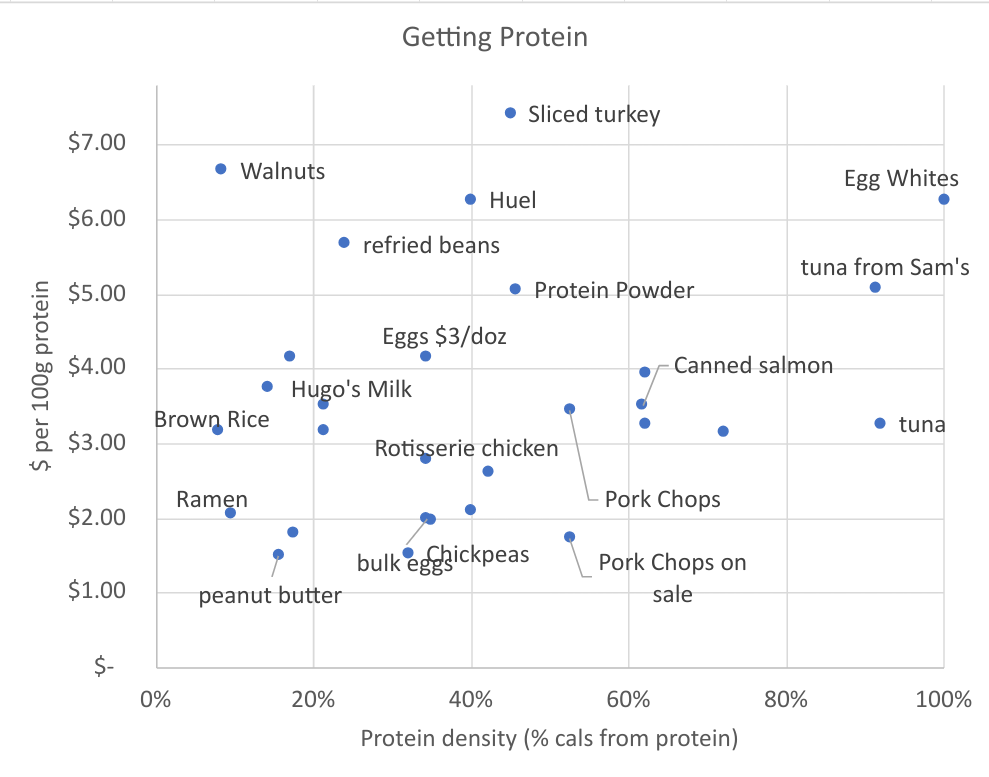

# The Protein Plot

When it comes to eating cheaply, the most important macronutrient is protein. Specifically, you don't need to buy fat and carbs because *if you get enough cheap protein, you'll get the fat and carbs for free*. 

I've made a list of what a frugal person needs to prioritize to get enough food.
1. Protein 
2. Fiber 
3. Vitamins
4. Micronutrients

# Q&A 

> But David, you don't even have calories on that list, let alone fat and carbs! Where are calories? You can't survive without fat and carbs! 

Great question. The answer is, *if you get enough cheap protein, you'll get the calories and fat and carbs for free*. 

> But I don't need to get more food, I need *less* food!

Yeah, good point.
There's evidence to suggest that higher-protein diets help you eat less food.

Keep in mind that this is a utilitarian approach; it assumes you're a robot that just needs to hit its quota of macros so it doesn't shut down. Most people in today's world have no problem getting enough calories. Our primary problem is in our *relationship* to food. We use food not to fuel our bodies, but to relieve our anxiety or boredom. 

> why should we make this plot, or pay any attention to it? 

1. you actually need food, at least some kind of food. You just don't know how much you need, or what kind of food you need. And that's how your anxiety/boredom/stress complex convinces you to eat potato chips; you know you need some sort of food, and I guess potato chips are food. 
2. you need cheap food. You can't afford to buy all these meals from Factor and HelloFresh and UberHealthyEatsFast.

