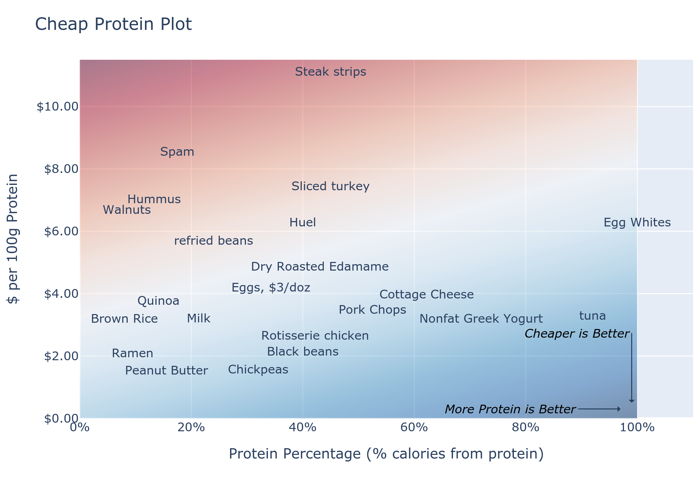

# The Protein Plot

# Intro
This is the Protein Plot, a tool to help you identify cheap protein. You can use cheap protein as the driver for cheap food.

# How I got here

So I'm putting together the grocery list  for the billionth time, or else wandering through the store for the billionth time,
or sticking my head in the fridge for the billionth time.
What to eat? What to buy?
I know there's a tradeoff between good food and cheap food, and I know there's some food that's both good *and* cheap.
But I don't know how to figure it out, so half the time I just grab something easy - in other words, neither good nor cheap.

With the Protein Plot I know what's good *and* cheap.

I collected the prices and Nutrition Facts of a bunch of different foods.
I calculated two numbers: the Protein Price and the Protein Percentage.
Why, you ask? Well, because *if you get enough cheap protein, you'll get the calories and fat and carbs for free*.

# How to Use It

The goal is to get the *highest Protein Percentage* (further to the right) for the *lowest Protein Price* (further down).
Use the plot to train your instincts.

- Greek yogurt (70% protein, $3/100g) is a much better protein source than a protein shake like Huel (40%, $6/100g). I mean it tastes like chalk, but that's not quantified on the plot.
- Pork chops are better than ground beef.
- As far as dry beans go, chickpeas are a little better than black beans, but they're close.

# How to Make It
I gathered prices and Nutrition Facts over the course of a couple years. I live in North Dakota and shop mostly at Sam's Club, and I gathered these prices mostly in 2022. 
So these prices are pretty cheap.

Formulas are pretty straightforward:

$Protein\ Density = \frac{g\ Protein\ per\ serving \times 4}{Calories\ per\ serving}$

$\$\ per\ 100g\ Protein = \frac{Container\ Price}{Servings\ per\ container\ \times\ g\ Protein\ per\ serving}\times 100$

# If you get enough cheap protein, you'll get the calories and fat and carbs for free

What's the definition of cheap food? Price per pound?
That's silly, you can just pump a bunch of water into a food for more or less free,
so the cheapest foods are just the ones with the most water. That's not right.

What about price per calorie?
I'm an energy engineer, which means I like to think about prices of different forms of energy,
from coal $1/GJ to electricity $30/GJ.
The problem there is that optimizing a diet based on energy doesn't work well.
A calorie (kcal) is 4.184 kJ, so there are about 240,000 calories in a GJ.
Turns out brown rice, the cheapest calorie source, is $150/GJ, and beef jerky is closer to $3,000/GJ.
So brown rice wins.
And as it turns out, all the carb-rich and fat-rich foods win at the cheap-energy game.
Carbs and fat are *way* cheaper than protein on an energy basis.

In fact, carbs and fat are so much cheaper that if you
What surprised me is that the more protein-rich a food is, the more you pay for that protein.
Carbs and fat are the opposite. Pure carbs, i.e. flour or sugar, is cheap per gram of carbs, and pure oil is cheap per gram of fat.
But protein doesn't work that way. There aren't really any pure protein sources, and the more you concentrate the protein, the more expensive it gets.
This means that when it comes to eating cheaply, the most important macronutrient is protein.
Specifically, you don't need to buy fat and carbs because *if you get enough cheap protein, you'll get the fat and carbs for free*.

# Stadem's Hierarchy of Food Needs

In the vein of [Maslow's Hierarchy of Needs](https://en.wikipedia.org/wiki/Maslow%27s_hierarchy_of_needs),
I've made a list of my own personal food needs.
I need to meet the needs at the front of the list before I get to the needs at the back.
I do myself a disservice if I'm pounding kiwis to get all my micronutrients when I haven't gotten enough protein.

If carbs and fat are basically free, then I can skip ahead and check off level 3,
because if I get enough *cheap* protein then I will definitely get enough calories.

1. Water
2. Calories
3. Protein
4. Fiber
5. Minimize "Bad Stuff" (trans fats, carcinogens, microplastics)
6. Vitamins/Micronutrients

# Q&A

> But David, you don't even have calories on that list, let alone fat and carbs! Where are calories? You can't survive without fat and carbs!

Great question. The answer is, *if you get enough cheap protein, you'll get the calories and fat and carbs for free*.

> But I don't need to get more food, I need *less* food!

Yeah, good point.
There's evidence to suggest that higher-protein diets help you eat less food.

Keep in mind that this is a utilitarian approach; it assumes you're a robot that just needs to hit its quota of macros so it doesn't shut down. Most people in today's world have no problem getting enough calories. Our primary problem is in our *relationship* to food. We use food not to fuel our bodies, but to relieve our anxiety or boredom.

> why should we make this plot, or pay any attention to it?

1. you actually need food, at least some kind of food. You just don't know how much you need, or what kind of food you need. And that's how your anxiety/boredom/stress complex convinces you to eat potato chips; you know you need some sort of food, and I guess potato chips are food.
2. you need cheap food. You can't afford to buy all these meals from Factor and HelloFresh and UberHealthyEatsFast.

# Conclusion

See this site at https://github.com/davidstadem/protein-plot
